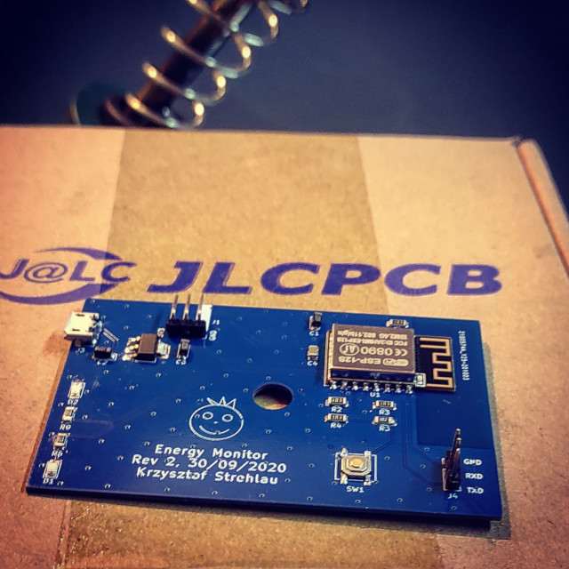

#  Energy Monitor firmware (emon_fw)

Inspired by other project, that counts rotations of energy meter's ring, I've decided to create my own esp-based board doing the same.

First board revision based on digital readings, this technique however, introduced many problems, because it was very light-sensitive. Bright sunlight sometimes affected measurements.

Second revision uses ADC instead, so I can detect rotations more precisely. From EMI perspective this board is designed better. I've had few troubles soldering this, because it failed to start for the first time - due to wrong AMS1117 version ordered. However I've managed to replace this IC with correct one.

Along with hardware-part, I'm working on software - framework for IoT devices like this one, so end user application might be developed fairly quick!

## Reuqirements
- MMU 16 KB Cache + 48 KB IRAM and 2nd Heap
- Flash: 4 MB (1MB FS, OTA: 1019 KB)
- CPU: 80 MHz
- SDK: 191122
- LWIP: 2 (lower rom use)
- VTables: IRAM
- Non32 Bit access (Use pgm read)

# See project on hackaday
https://hackaday.io/project/175653-iot-for-old-energy-meter

# In action ...

  

  

